# Controllers UML

The following UML class diagram represents the REST controllers of the **CleanList** backend. Each controller exposes RESTful CRUD endpoints using **Spring MVC** and communicates through Request and Response DTOs.

```mermaid
classDiagram

%% ===========================
%% AUTHENTICATION
%% ===========================

class AuthController {
    +login(request: LoginRequest) : ResponseEntity<AuthResponse>
    +refreshToken(request: RefreshTokenRequest) : ResponseEntity<AuthResponse>
    +logout() : ResponseEntity<Void>
    +googleLogin() : void
    +googleCallback(code: String) : ResponseEntity<AuthResponse>
}

%% ===========================
%% USERS
%% ===========================

class UserController {
    +listAllActive() : ResponseEntity<List<UserResponse>>
    +listTrashed() : ResponseEntity<List<UserResponse>>
    +getById(id: Long) : ResponseEntity<UserResponse>
    +create(request: UserRequest) : ResponseEntity<UserResponse>
    +update(id: Long, request: UserRequest) : ResponseEntity<UserResponse>
    +softDelete(id: Long) : ResponseEntity<Void>
    +restore(id: Long) : ResponseEntity<Void>
    +hardDelete(id: Long) : ResponseEntity<Void>
}

class RoleController {
    +listAllActive() : ResponseEntity<List<RoleResponse>>
    +listTrashed() : ResponseEntity<List<RoleResponse>>
    +getById(id: Long) : ResponseEntity<RoleResponse>
    +create(request: RoleRequest) : ResponseEntity<RoleResponse>
    +update(id: Long, request: RoleRequest) : ResponseEntity<RoleResponse>
    +softDelete(id: Long) : ResponseEntity<Void>
    +restore(id: Long) : ResponseEntity<Void>
    +hardDelete(id: Long) : ResponseEntity<Void>
}

class SessionController {
    +listAllActive() : ResponseEntity<List<SessionResponse>>
    +listTrashed() : ResponseEntity<List<SessionResponse>>
    +getById(id: Long) : ResponseEntity<SessionResponse>
    +softDelete(id: Long) : ResponseEntity<Void>
    +restore(id: Long) : ResponseEntity<Void>
    +hardDelete(id: Long) : ResponseEntity<Void>
}

%% ===========================
%% CLEANING LISTS
%% ===========================

class CleaningListController {
    +listAllActive() : ResponseEntity<List<CleaningListResponse>>
    +listTrashed() : ResponseEntity<List<CleaningListResponse>>
    +getById(id: Long) : ResponseEntity<CleaningListResponse>
    +create(request: CleaningListRequest) : ResponseEntity<CleaningListResponse>
    +update(id: Long, request: CleaningListRequest) : ResponseEntity<CleaningListResponse>
    +softDelete(id: Long) : ResponseEntity<Void>
    +restore(id: Long) : ResponseEntity<Void>
    +hardDelete(id: Long) : ResponseEntity<Void>
}

%% ===========================
%% MEMBERS
%% ===========================

class MemberController {
    +listAllActive() : ResponseEntity<List<MemberResponse>>
    +listTrashed() : ResponseEntity<List<MemberResponse>>
    +getById(id: Long) : ResponseEntity<MemberResponse>
    +create(request: MemberRequest) : ResponseEntity<MemberResponse>
    +update(id: Long, request: MemberRequest) : ResponseEntity<MemberResponse>
    +softDelete(id: Long) : ResponseEntity<Void>
    +restore(id: Long) : ResponseEntity<Void>
    +hardDelete(id: Long) : ResponseEntity<Void>
}

%% ===========================
%% GROUPS
%% ===========================

class GroupController {
    +listAllActive() : ResponseEntity<List<GroupResponse>>
    +listTrashed() : ResponseEntity<List<GroupResponse>>
    +getById(id: Long) : ResponseEntity<GroupResponse>
    +create(request: GroupRequest) : ResponseEntity<GroupResponse>
    +update(id: Long, request: GroupRequest) : ResponseEntity<GroupResponse>
    +softDelete(id: Long) : ResponseEntity<Void>
    +restore(id: Long) : ResponseEntity<Void>
    +hardDelete(id: Long) : ResponseEntity<Void>
}

class GroupMemberController {
    +listAll() : ResponseEntity<List<GroupMemberResponse>>
    +getByGroup(groupId: Long) : ResponseEntity<List<GroupMemberResponse>>
    +addMember(request: GroupMemberRequest) : ResponseEntity<GroupMemberResponse>
    +removeMember(groupId: Long, memberId: Long) : ResponseEntity<Void>
}

%% ===========================
%% SCHEDULES
%% ===========================

class ScheduleController {
    +listAllActive() : ResponseEntity<List<ScheduleResponse>>
    +listTrashed() : ResponseEntity<List<ScheduleResponse>>
    +getById(id: Long) : ResponseEntity<ScheduleResponse>
    +create(request: ScheduleRequest) : ResponseEntity<ScheduleResponse>
    +update(id: Long, request: ScheduleRequest) : ResponseEntity<ScheduleResponse>
    +softDelete(id: Long) : ResponseEntity<Void>
    +restore(id: Long) : ResponseEntity<Void>
    +hardDelete(id: Long) : ResponseEntity<Void>
}

%% ===========================
%% NO CLEANING DAYS
%% ===========================

class NoCleaningDayController {
    +listAll() : ResponseEntity<List<NoCleaningDayResponse>>
    +getById(id: Long) : ResponseEntity<NoCleaningDayResponse>
    +create(request: NoCleaningDayRequest) : ResponseEntity<NoCleaningDayResponse>
    +update(id: Long, request: NoCleaningDayRequest) : ResponseEntity<NoCleaningDayResponse>
    +delete(id: Long) : ResponseEntity<Void>
}

%% ===========================
%% ASSIGNMENTS
%% ===========================

class AssignmentController {
    +listAllActive() : ResponseEntity<List<AssignmentResponse>>
    +listTrashed() : ResponseEntity<List<AssignmentResponse>>
    +getById(id: Long) : ResponseEntity<AssignmentResponse>
    +getBySchedule(scheduleId: Long) : ResponseEntity<List<AssignmentResponse>>
    +create(request: AssignmentRequest) : ResponseEntity<AssignmentResponse>
    +update(id: Long, request: AssignmentRequest) : ResponseEntity<AssignmentResponse>
    +complete(id: Long) : ResponseEntity<AssignmentResponse>
    +softDelete(id: Long) : ResponseEntity<Void>
    +restore(id: Long) : ResponseEntity<Void>
    +hardDelete(id: Long) : ResponseEntity<Void>
}

%% ===========================
%% HISTORY
%% ===========================

class AssignmentHistoryController {
    +listByAssignment(assignmentId: Long) : ResponseEntity<List<AssignmentHistoryResponse>>
    +getById(id: Long) : ResponseEntity<AssignmentHistoryResponse>
}
```

