# Controllers UML

The following UML class diagram represents the REST controllers of the **CleanList** backend. Each controller exposes reactive CRUD endpoints using Spring WebFlux and communicates through Request and Response DTOs.

```mermaid
classDiagram

%% ===========================
%% AUTHENTICATION
%% ===========================

class AuthController {
    +login(request: LoginRequest) : Mono<ResponseEntity<AuthResponse>>
    +refreshToken(request: RefreshTokenRequest) : Mono<ResponseEntity<AuthResponse>>
    +logout() : Mono<ResponseEntity<Void>>
    +googleLogin() : Mono<Void>
    +googleCallback(code: String) : Mono<ResponseEntity<AuthResponse>>
}

%% ===========================
%% USERS
%% ===========================

class UserController {
    +listAllActive() : Mono<ResponseEntity<List<UserResponse>>>
    +listTrashed() : Mono<ResponseEntity<List<UserResponse>>>
    +getById(id: Long) : Mono<ResponseEntity<UserResponse>>
    +create(request: UserRequest) : Mono<ResponseEntity<UserResponse>>
    +update(id: Long, request: UserRequest) : Mono<ResponseEntity<UserResponse>>
    +softDelete(id: Long) : Mono<ResponseEntity<Void>>
    +restore(id: Long) : Mono<ResponseEntity<Void>>
    +hardDelete(id: Long) : Mono<ResponseEntity<Void>>
}

class RoleController {
    +listAllActive() : Mono<ResponseEntity<List<RoleResponse>>>
    +listTrashed() : Mono<ResponseEntity<List<RoleResponse>>>
    +getById(id: Long) : Mono<ResponseEntity<RoleResponse>>
    +create(request: RoleRequest) : Mono<ResponseEntity<RoleResponse>>
    +update(id: Long, request: RoleRequest) : Mono<ResponseEntity<RoleResponse>>
    +softDelete(id: Long) : Mono<ResponseEntity<Void>>
    +restore(id: Long) : Mono<ResponseEntity<Void>>
    +hardDelete(id: Long) : Mono<ResponseEntity<Void>>
}

class SessionController {
    +listAllActive() : Mono<ResponseEntity<List<SessionResponse>>>
    +listTrashed() : Mono<ResponseEntity<List<SessionResponse>>>
    +getById(id: Long) : Mono<ResponseEntity<SessionResponse>>
    +softDelete(id: Long) : Mono<ResponseEntity<Void>>
    +restore(id: Long) : Mono<ResponseEntity<Void>>
    +hardDelete(id: Long) : Mono<ResponseEntity<Void>>
}

%% ===========================
%% CLEANING LIST
%% ===========================

class CleaningListController {
    +listAllActive() : Mono<ResponseEntity<List<CleaningListResponse>>>
    +listTrashed() : Mono<ResponseEntity<List<CleaningListResponse>>>
    +getById(id: Long) : Mono<ResponseEntity<CleaningListResponse>>
    +create(request: CleaningListRequest) : Mono<ResponseEntity<CleaningListResponse>>
    +update(id: Long, request: CleaningListRequest) : Mono<ResponseEntity<CleaningListResponse>>
    +softDelete(id: Long) : Mono<ResponseEntity<Void>>
    +restore(id: Long) : Mono<ResponseEntity<Void>>
    +hardDelete(id: Long) : Mono<ResponseEntity<Void>>
}

%% ===========================
%% MEMBERS
%% ===========================

class MemberController {
    +listAllActive() : Mono<ResponseEntity<List<MemberResponse>>>
    +listTrashed() : Mono<ResponseEntity<List<MemberResponse>>>
    +getById(id: Long) : Mono<ResponseEntity<MemberResponse>>
    +create(request: MemberRequest) : Mono<ResponseEntity<MemberResponse>>
    +update(id: Long, request: MemberRequest) : Mono<ResponseEntity<MemberResponse>>
    +softDelete(id: Long) : Mono<ResponseEntity<Void>>
    +restore(id: Long) : Mono<ResponseEntity<Void>>
    +hardDelete(id: Long) : Mono<ResponseEntity<Void>>
}

%% ===========================
%% GROUPS
%% ===========================

class GroupController {
    +listAllActive() : Mono<ResponseEntity<List<GroupResponse>>>
    +listTrashed() : Mono<ResponseEntity<List<GroupResponse>>>
    +getById(id: Long) : Mono<ResponseEntity<GroupResponse>>
    +create(request: GroupRequest) : Mono<ResponseEntity<GroupResponse>>
    +update(id: Long, request: GroupRequest) : Mono<ResponseEntity<GroupResponse>>
    +softDelete(id: Long) : Mono<ResponseEntity<Void>>
    +restore(id: Long) : Mono<ResponseEntity<Void>>
    +hardDelete(id: Long) : Mono<ResponseEntity<Void>>
}

class GroupMemberController {
    +listAll() : Mono<ResponseEntity<List<GroupMemberResponse>>>
    +getByGroup(groupId: Long) : Mono<ResponseEntity<List<GroupMemberResponse>>>
    +addMember(request: GroupMemberRequest) : Mono<ResponseEntity<GroupMemberResponse>>
    +removeMember(groupId: Long, memberId: Long) : Mono<ResponseEntity<Void>>
}

%% ===========================
%% SCHEDULES
%% ===========================

class ScheduleController {
    +listAllActive() : Mono<ResponseEntity<List<ScheduleResponse>>>
    +listTrashed() : Mono<ResponseEntity<List<ScheduleResponse>>>
    +getById(id: Long) : Mono<ResponseEntity<ScheduleResponse>>
    +create(request: ScheduleRequest) : Mono<ResponseEntity<ScheduleResponse>>
    +update(id: Long, request: ScheduleRequest) : Mono<ResponseEntity<ScheduleResponse>>
    +softDelete(id: Long) : Mono<ResponseEntity<Void>>
    +restore(id: Long) : Mono<ResponseEntity<Void>>
    +hardDelete(id: Long) : Mono<ResponseEntity<Void>>
}

%% ===========================
%% ASSIGNMENTS
%% ===========================

class AssignmentController {
    +listAllActive() : Mono<ResponseEntity<List<AssignmentResponse>>>
    +listTrashed() : Mono<ResponseEntity<List<AssignmentResponse>>>
    +getById(id: Long) : Mono<ResponseEntity<AssignmentResponse>>
    +getBySchedule(scheduleId: Long) : Mono<ResponseEntity<List<AssignmentResponse>>>
    +create(request: AssignmentRequest) : Mono<ResponseEntity<AssignmentResponse>>
    +update(id: Long, request: AssignmentRequest) : Mono<ResponseEntity<AssignmentResponse>>
    +complete(id: Long) : Mono<ResponseEntity<AssignmentResponse>>
    +softDelete(id: Long) : Mono<ResponseEntity<Void>>
    +restore(id: Long) : Mono<ResponseEntity<Void>>
    +hardDelete(id: Long) : Mono<ResponseEntity<Void>>
}

%% ===========================
%% HISTORY
%% ===========================

class AssignmentHistoryController {
    +listByAssignment(assignmentId: Long) : Mono<ResponseEntity<List<AssignmentHistoryResponse>>>
    +getById(id: Long) : Mono<ResponseEntity<AssignmentHistoryResponse>>
}
```

