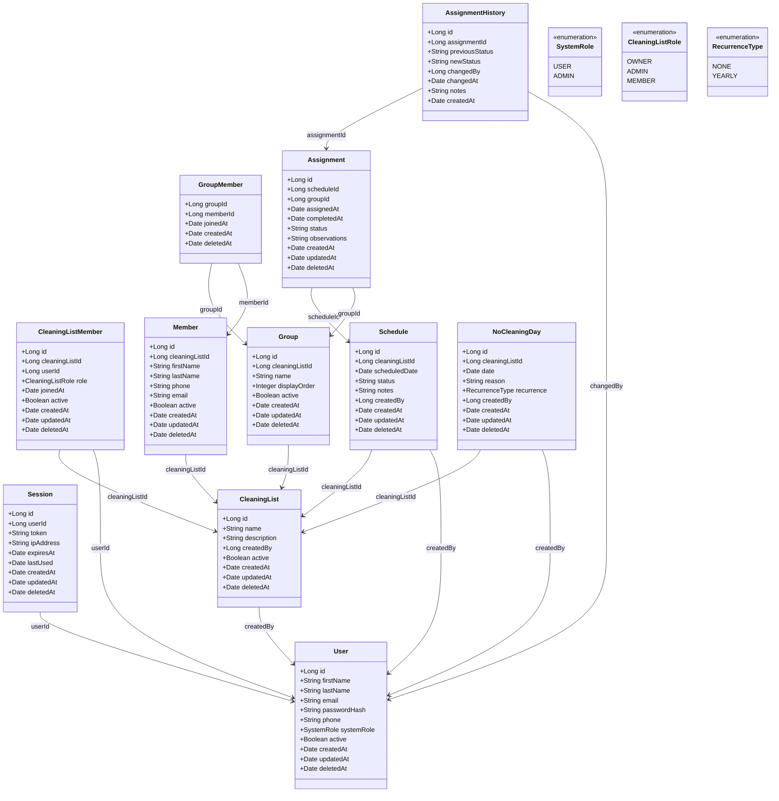

# Entities UML

The following UML class diagram represents the main domain entities of the **CleanList** backend and their relationships.

```mermaid
classDiagram

%% ===========================
%% USERS & AUTHENTICATION
%% ===========================

class User {
    +Long id
    +String firstName
    +String lastName
    +String email
    +String passwordHash
    +String phone
    +SystemRole systemRole
    +Boolean active
    +Date createdAt
    +Date updatedAt
    +Date deletedAt
}

class Session {
    +Long id
    +Long userId
    +String token
    +String ipAddress
    +Date expiresAt
    +Date lastUsed
    +Date createdAt
    +Date updatedAt
    +Date deletedAt
}

%% ===========================
%% CLEANING LISTS
%% ===========================

class CleaningList {
    +Long id
    +String name
    +String description
    +Long createdBy
    +Boolean active
    +Date createdAt
    +Date updatedAt
    +Date deletedAt
}

class CleaningListMember {
    +Long id
    +Long cleaningListId
    +Long userId
    +CleaningListRole role
    +Date joinedAt
    +Boolean active
    +Date createdAt
    +Date updatedAt
    +Date deletedAt
}

%% ===========================
%% MEMBERS
%% ===========================

class Member {
    +Long id
    +Long cleaningListId
    +String firstName
    +String lastName
    +String phone
    +String email
    +Boolean active
    +Date createdAt
    +Date updatedAt
    +Date deletedAt
}

%% ===========================
%% GROUPS
%% ===========================

class Group {
    +Long id
    +Long cleaningListId
    +String name
    +Integer displayOrder
    +Boolean active
    +Date createdAt
    +Date updatedAt
    +Date deletedAt
}

class GroupMember {
    +Long groupId
    +Long memberId
    +Date joinedAt
    +Date createdAt
    +Date deletedAt
}

%% ===========================
%% SCHEDULES
%% ===========================

class Schedule {
    +Long id
    +Long cleaningListId
    +Date scheduledDate
    +String status
    +String notes
    +Long createdBy
    +Date createdAt
    +Date updatedAt
    +Date deletedAt
}

%% ===========================
%% NO CLEANING DAYS
%% ===========================

class NoCleaningDay {
    +Long id
    +Long cleaningListId
    +Date date
    +String reason
    +RecurrenceType recurrence
    +Long createdBy
    +Date createdAt
    +Date updatedAt
    +Date deletedAt
}

%% ===========================
%% ASSIGNMENTS
%% ===========================

class Assignment {
    +Long id
    +Long scheduleId
    +Long groupId
    +Date assignedAt
    +Date completedAt
    +String status
    +String observations
    +Date createdAt
    +Date updatedAt
    +Date deletedAt
}

class AssignmentHistory {
    +Long id
    +Long assignmentId
    +String previousStatus
    +String newStatus
    +Long changedBy
    +Date changedAt
    +String notes
    +Date createdAt
}

%% ===========================
%% ENUMS
%% ===========================

class SystemRole {
    <<enumeration>>
    USER
    ADMIN
}

class CleaningListRole {
    <<enumeration>>
    OWNER
    ADMIN
    MEMBER
}

class RecurrenceType {
    <<enumeration>>
    NONE
    YEARLY
}

%% ===========================
%% RELATIONSHIPS
%% ===========================

Session --> User : userId

CleaningList --> User : createdBy

CleaningListMember --> CleaningList : cleaningListId
CleaningListMember --> User : userId

Member --> CleaningList : cleaningListId

Group --> CleaningList : cleaningListId

GroupMember --> Group : groupId
GroupMember --> Member : memberId

Schedule --> CleaningList : cleaningListId
Schedule --> User : createdBy

NoCleaningDay --> CleaningList : cleaningListId
NoCleaningDay --> User : createdBy

Assignment --> Schedule : scheduleId
Assignment --> Group : groupId

AssignmentHistory --> Assignment : assignmentId
AssignmentHistory --> User : changedBy
```